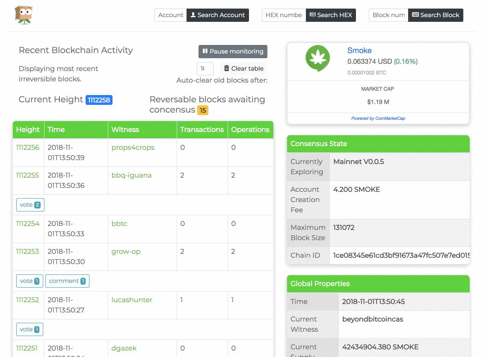

# What is the Smoke blockchain?

The Smoke blockchain is a Delegated Proof of Stake (DPoS) blockchain based on Steem, capable of over 1000 transactions per second with a block being produced every 3 seconds.

Instead of mining Smoke uses a social consensus algorithm for token allocation that rewards contributions to the network:

- Currency symbol SMOKE.
- Initial supply 42,000,000 SMOKE
- Inflation rate of 9.5% per year, reducing by 0.5% per annum until the rewards drop to 5% per annum.
- 75% of inflation to social consensus algorithm.
- 15% of inflation to stake holders.
- 10% of inflation to block producers.

Using DPoS (Delegated Proof of Stake) allows users free transactions and usage of the network as long as they have enough vested Smoke.

To learn more read our technical [whitepaper](https://smoke.network/Smoke-Whitepaper-2.0.pdf), [blockchain codebase](https://github.com/smokenetwork/smoked/) or take a look at our [blockchain explorer](https://explore.smoke.io).

